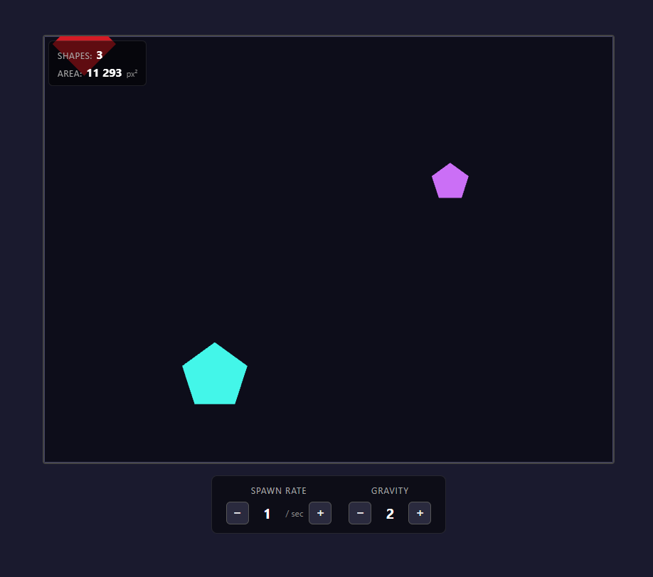
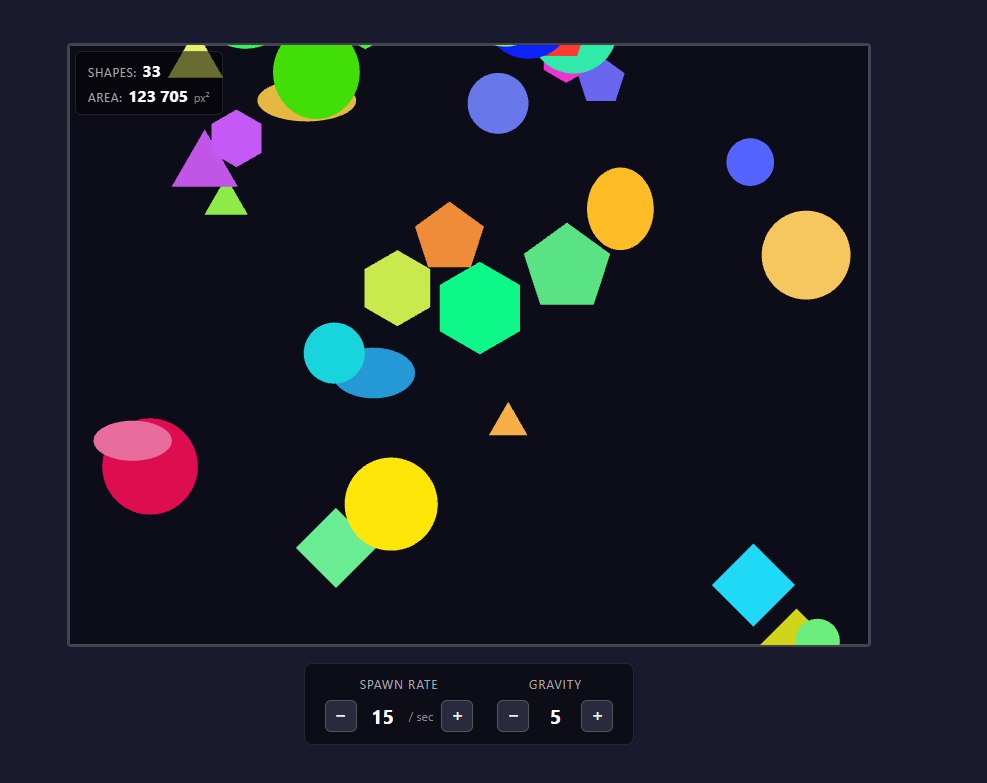
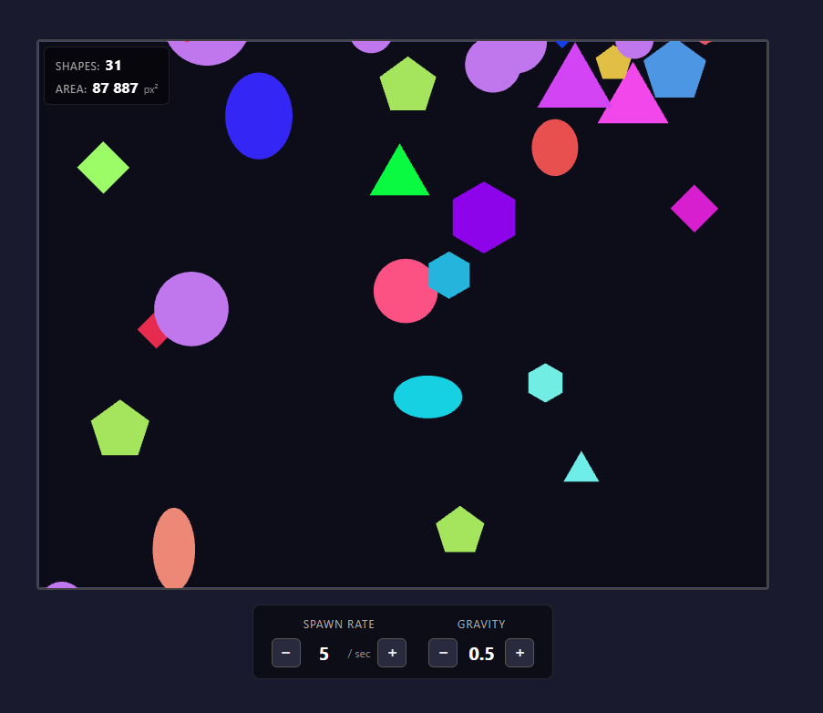

# PixiJS Shape Playground

An interactive playground built with **PixiJS v8** and **TypeScript** where colorful shapes fall from the top of a generation area. Click to spawn shapes, click a shape to remove it and recolor all shapes of the same type.

## Live Demo

> **[https://maxkurylenko1.github.io/pixi-shapes/](https://maxkurylenko1.github.io/pixi-shapes/)**

## Features

- **7 shape types**: triangle, quad, pentagon, hexagon, circle, ellipse (spawned randomly)
- **Gravity-based falling**: shapes accelerate downward and disappear at the bottom
- **Click empty area** → spawn a new shape at cursor position
- **Click a shape** → remove it + recolor all shapes of the same type
- **HUD**: live count of shapes on screen + total area in px²
- **Controls**: adjust spawn rate (shapes/sec) and gravity with `+` / `−` buttons
- **MVC + OOP architecture**, TypeScript strict mode

## Stack

| Tool                                          | Role                   |
| --------------------------------------------- | ---------------------- |
| [PixiJS v8](https://pixijs.com/)              | WebGL canvas rendering |
| [TypeScript](https://www.typescriptlang.org/) | Strict typing          |
| [Vite](https://vitejs.dev/)                   | Dev server + build     |
| ESLint + Prettier                             | Code quality           |
| GitHub Pages                                  | Hosting                |

## Getting Started

### Prerequisites

- Node.js 18+
- npm 9+

### Install & run

```bash
git clone https://github.com/yourusername/pixi-shapes.git
cd pixi-shapes
npm install
npm run dev
```

Open [http://localhost:5173/pixi-shapes/](http://localhost:5173/pixi-shapes/)

### Build for production

```bash
npm run build
# Output: dist/
```

### Preview production build

```bash
npm run preview
```

### Lint & format

```bash
npm run lint          # ESLint
npm run format:check  # Prettier check
npm run format        # Prettier write
```

## Project Structure

```
src/
├── main.ts                    # Entry point
├── app/
│   └── App.ts                 # Bootstrap — wires Model + View + Controllers
├── model/
│   ├── GameModel.ts           # Shape collection + config state
│   └── types.ts               # ShapeType enum, Config interface
├── domain/
│   ├── Shape.ts               # Base Shape class
│   ├── shapes/                # PolygonShape, CircleShape, EllipseShape
│   ├── ShapeFactory.ts        # Creates random shapes
│   └── areaCalculator.ts      # Area formulas per shape type
├── view/
│   ├── GameView.ts            # PixiJS stage setup + render sync
│   ├── ShapeRenderer.ts       # Draws Shape → Graphics; manages render map
│   └── HudView.ts             # Updates DOM count/area elements
├── controller/
│   ├── GameController.ts      # Game loop (Ticker), physics, auto-spawn
│   ├── InputController.ts     # Click-to-spawn + click-shape interaction
│   └── ControlsController.ts  # +/- buttons for spawn rate & gravity
└── utils/
    ├── randomColor.ts         # HSL → hex color generator
    └── constants.ts           # Area size, default values, shape size range
```

## Architecture

The project follows **MVC + OOP**:

- **Model** (`GameModel`) — pure data: shape collection, config. No rendering.
- **View** (`GameView`, `ShapeRenderer`, `HudView`) — reads Model, renders with PixiJS, updates DOM.
- **Controller** (`GameController`, `InputController`, `ControlsController`) — handles events, mutates Model, drives the game loop.
- **Domain** (`Shape` subclasses, `ShapeFactory`, `areaCalculator`) — pure business logic, no PixiJS dependency.

## Deploy to GitHub Pages

The project includes a GitHub Actions workflow that deploys to GitHub Pages on every push to `main`.

**Setup:**

1. Go to _Settings → Pages → Source_: select **GitHub Actions**
2. Push to `main` — the workflow builds and deploys automatically

Alternatively deploy manually:

```bash
npm run build
# Upload dist/ to your static hosting
```

## Screenshots

**Few shapes — low spawn rate (1/sec), gravity 2:**



**Many shapes — high spawn rate (15/sec), gravity 5:**



**All shape types — spawn rate 5/sec, gravity 0.5:**



---

Made with PixiJS v8 + TypeScript
